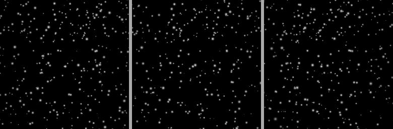

# openptv_test_case_352
This is my personal attempt to test OpenPTV software performance on the case 352 from the www.piv.jp

Working folder for test case #352 from the www.piv.jp analysed long time ago on a 3D-PTV software (C/Tcl-Tk version) by Alex Liberzon. The synthetic data belongs to the authors of the Synthetic PIV project. 

A copy of the raw data is available from the Google Drive folder https://drive.google.com/open?id=0B48pBs4OPhMOclNROUttTnRjSGc

Please respect the copyright of the original authors: 

https://web.archive.org/web/20161028235456/http://piv.jp/image3d/image-e.html

### The result is in the Jupyter notebook

https://github.com/alexlib/openptv_test_case_352/blob/master/notebooks/ptv_is_case352.ipynb
